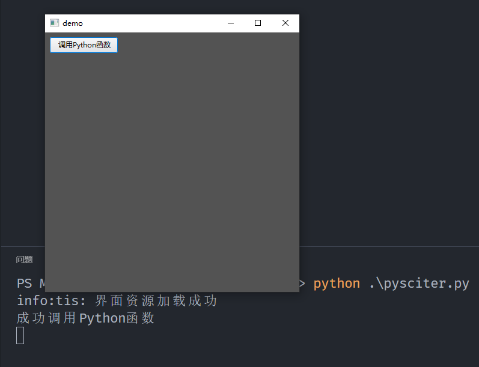

本文记录pysciter最小工程示例的搭建步骤。

步骤一：安装pysciter

在命令行中输入`pip install pysciter`即可完成pysciter库的安装。

步骤二：下载sciter-sdk

sciter-sdk下载地址：https://github.com/c-smile/sciter-sdk

访问下载地址，点击界面上的绿色`Code`按钮，在弹出界面中选择最下方的`Download ZIP`下载压缩包，下载完成之后将其解压，并将解压路径下的`bin.win/x64`目录添加到环境变量的系统变量Path中，该目录下包含运行所需的sciter.dll文件。

步骤三：编写代码文件和资源文件

创建一个代码文件`pysciter.py`，其内容如下

```python
import sciter

import os

class Frame(sciter.Window):

    def __init__(self):
        super().__init__(ismain=True, uni_theme=True)
        pass

    # 可以在tis脚本中通过view.call_python()调用此函数
    @sciter.script
    def call_python(self, arg):
        print('成功调用Python函数')
        pass

    
if __name__ == '__main__':
    sciter.runtime_features(allow_sysinfo=True, file_io=True)

    htm = os.path.join(os.path.dirname(__file__), 'pysciter.htm')

    frame = Frame()
    frame.set_dispatch_options(raw_handlers=False)
    frame.load_file(htm)
    frame.run_app()
```

分别创建资源文件`pysciter.htm`、`pysciter.css`和`pysciter.tis`文件。

```html
<!-- pysciter.htm -->
<html>

<head>
    <title>demo</title>
    <style>
        @import url(pysciter.css);
    </style>

    <script type="text/tiscript">
        include "pysciter.tis";
    </script>
</head>

<body>

    <button #script_call_python>调用Python函数</button>

</body>

</html>
```

```css
/* pysciter.css */
html {
    background: #535353;
    color: #FFFFFF;
}
```

```typescript
// pysciter.tis
function self.ready() {
    stdout << String.printf("界面资源加载成功\n");

    $(button#script_call_python).on("click", on_script_call_python_click);
}

function on_script_call_python_click() {
    var retval = view.call_python("params");
}
```

代码文件用python语言编写，负责程序的逻辑，资源文件用html/css/tis语言编写，负责界面的显示。

步骤四：运行程序

将所有四个文件放到同一个目录下，打开命令行，进入该目录，命令行运行`python pysciter.py`即可看到如下界面。


